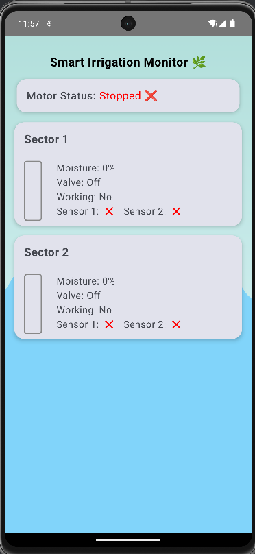
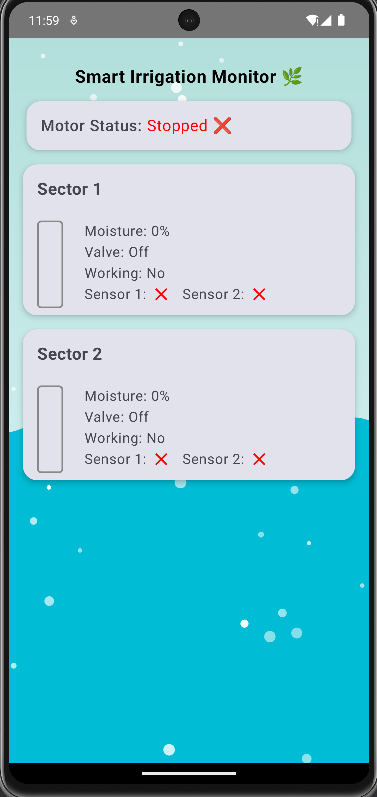

# 🌿 Smart Irrigation Android App

---

## 📱 About the App

The **Smart Irrigation Monitor** is a modern Android app built using Jetpack Compose. It connects to **Firebase Realtime Database** and provides real-time monitoring of two irrigation sectors.

Users can view:
- 🌡️ Moisture levels in each sector
- 💧 Valve status (On/Off)
- 🔄 Sector working status
- ✅ Sensor acknowledgments
- 🚜 Motor status (Running/Stopped)

Pull-to-refresh is supported, and the UI dynamically reflects Firebase data in real-time.

---

## 🛠 Tech Stack

- **Kotlin** – Modern Android development language
- **Jetpack Compose** – Declarative UI toolkit for native Android
- **Firebase Realtime Database** – Live data sync between app and backend
- **Material 3** – UI components and theming
- **Accompanist** – Swipe refresh composable
- **Custom Animations** – Water wave & bubbles animation based on motor state

---

## 🎨 UI Highlights & Animations

- 🌈 **Gradient background** for a nature-inspired visual
- 💦 **Water animations**:
    - `WaterWave`: Calm animation when the motor is off
    - `WaterWaveWithBubbles`: Animated bubbles when the motor is running
- 📊 **Moisture Progress Bars**:
    - Animated vertical bars indicating real-time soil moisture
- 🧾 **Motor and Sector Cards**:
    - Clean, rounded cards with emoji/status indicators
- 🔁 **Swipe to refresh**:
    - Pull down to refresh data manually
- 🟢 **Real-time updates**:
    - Automatically reflects database changes

---

## 🖼 App Screenshots

> Replace the image links with actual screenshots from your app.

### 💧 Sector Moisture View

### ✅ Motor Running View (With Bubbles)

---

> Designed and built with ❤️ for efficient and smart farming.
